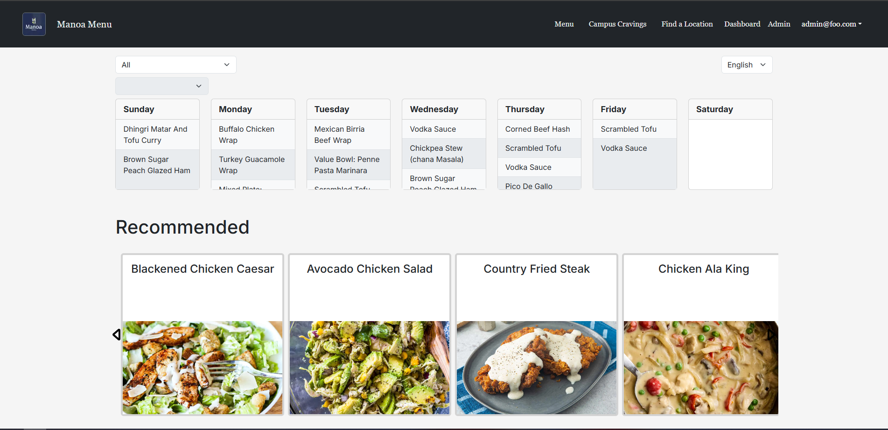
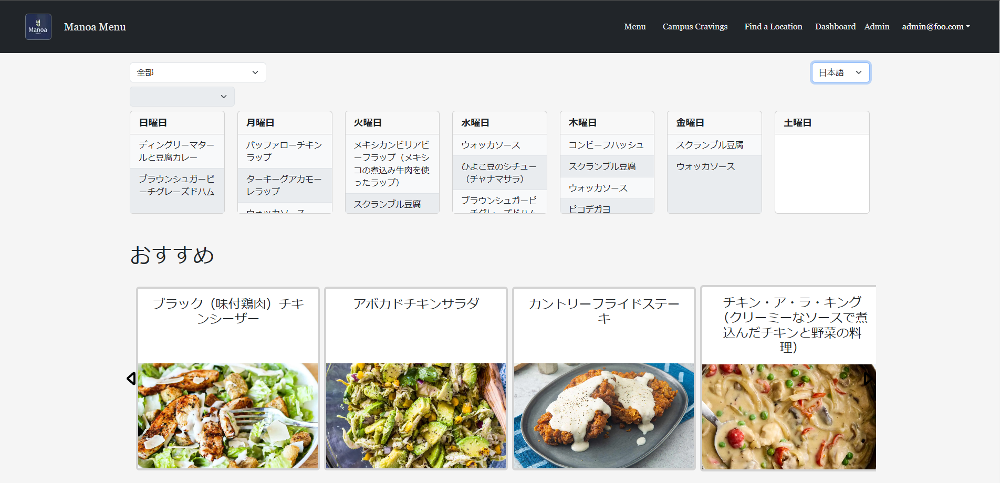
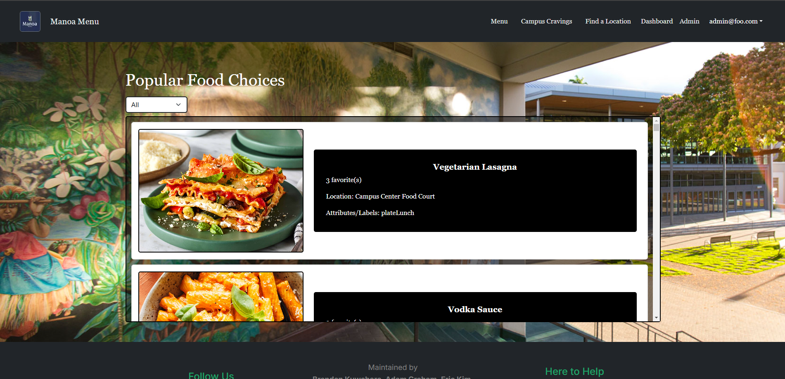
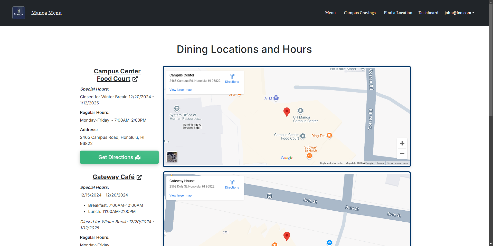
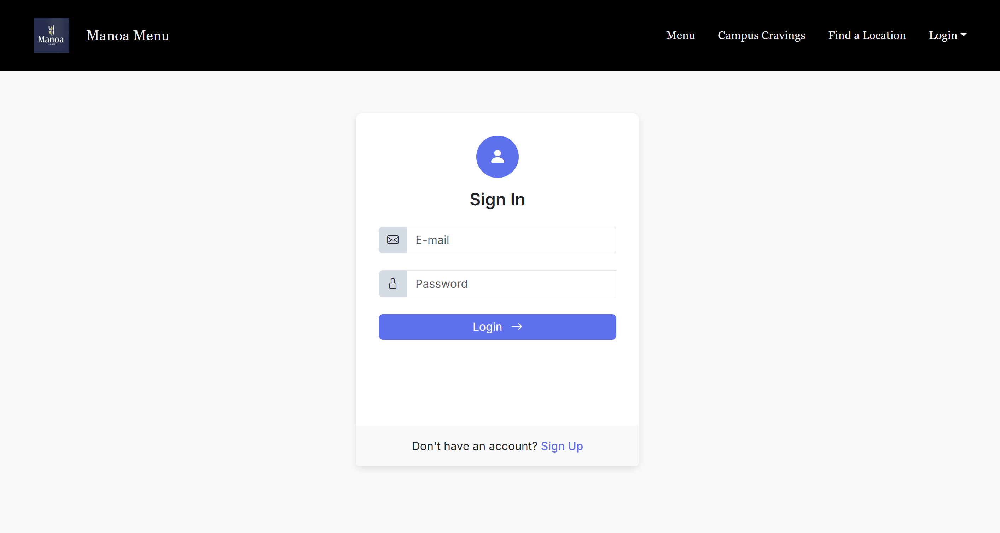
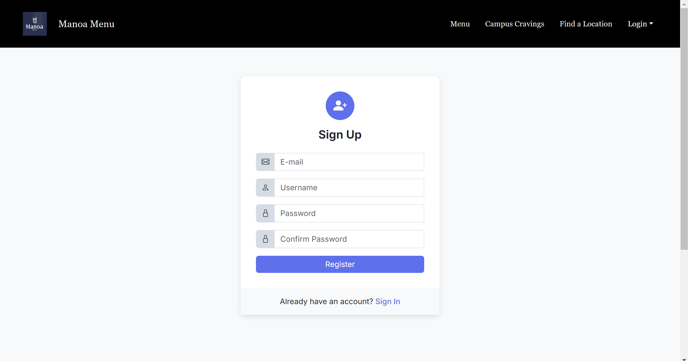

# Manoa Menu


## Table of contents

- [Manoa Menu](#manoa-menu)
  - [Table of contents](#table-of-contents)
  - [Overview](#overview)
  - [Approach](#approach)
  - [User Guide](#user-guide)
    - [Landing Page](#landing-page)
    - [Menu](#menu)
    - [Campus Center Menu](#campus-center-menu)
    - [Gateway Cafe Menu](#gateway-cafe-menu)
    - [Hale Aloha Cafe Menu](#hale-aloha-cafe-menu)
    - [Admin Page](#admin-page)
    - [Dashboard](#dashboard)
    - [Popular Items](#popular-items)
    - [Dining Location \& Hours](#dining-location--hours)
    - [Sign-in and Sign-up](#sign-in-and-sign-up)
  - [Community Feedback](#community-feedback)
      - [Community Comments](#community-comments)
      - [Community Feedback Checklist](#community-feedback-checklist)
  - [Developer Guide](#developer-guide)
    - [Installation](#installation)
  - [Deployment](#deployment)
    - [Application Design](#application-design)
  - [Continuous Integration](#continuous-integration)
  - [Development History](#development-history)
  - [Team](#team)
        - [Contact us if you have any comments or questions.](#contact-us-if-you-have-any-comments-or-questions)
    - [Team Contract](#team-contract)

## Overview

**The problem:** International students at UHM, particularly those from Japan, may find it difficult to read the Campus Center cafeteria menu. With local and western dishes that aren’t self-explanatory, using translation tools like Google Translate on each week's menu is tedious and often inaccurate.

**The solution:** The Manoa Menu web application translates the cafeteria menu from English to Japanese, ensuring accurate and culturally aware descriptions. The app adds supplementary information for menu items that might be unfamiliar. Users can view the menu without needing to log in, while logged-in users can save their favorite items and check if these favorites appear on the current week's menu.

## Approach
* **Front-end (Next.js):**
  * Menu and dashboard with clear, user-friendly interface
  * Translated menu and cultural item descriptions
  * Menu scraping from PDFs using tools like [PDF-Parse](https://www.npmjs.com/package/pdf-parse) or [PDF2JSON](https://www.npmjs.com/package/pdf2json)
* **Back-end (Prisma ORM & PostgreSQL):**
  * Database for user data and saved menu items
  * OpenAI API calls to generate descriptive details for unfamiliar menu items

## User Guide

This section provides an overview of Manoa Menu's user interface and functionalities.

### Landing Page

The landing page greets users and introduces Manoa Menu's features.


### Menu

This page shows the current cafeteria menu. By default, it displays in English, but users can select the Japanese translation if desired.

For Campus Center Menu scraping: 

- [PDF-Parse NPM](https://www.npmjs.com/package/pdf-parse)
- [JSDom NPM](https://www.npmjs.com/package/jsdom)


### Campus Center Menu


### Gateway Cafe Menu


### Hale Aloha Cafe Menu


### Admin Page

Menus can be manually edited in the event of translation errors or unexpected changes to the menu.


### Dashboard

Accessible after logging in, this page displays:
  - Saved favorite items and an indicator if any of these items are on this week’s menu
  - Recommended menu items, based on previous favorites




### Popular Items

This page shows popular menu items among other students, with an option to add items to favorites.



### Dining Location & Hours

This page features an embedded Google Maps for each eatery we support so you can easily find directions to the location.



### Sign-in and Sign-up

Click the "Login" button in the upper right corner to go to the sign-in page. Only registered users can sign in:



Alternatively, select "Sign up" to register as a new user:



## Community Feedback

We’d love to hear your thoughts on Manoa Menu! Feel free to take a few minutes to fill out the [Manoa Menu Feedback Form](https://forms.gle/fp6cH6FRNwqR3KMP6), which has just five questions to help us improve the website.

#### Community Comments:
- "Overall, the site is fantastic and very well-thought-out.  You guys seemed to have covered everything that a student would want to see.  I can see this being well utilized by many students, especially if you take suggestions on what they would like to see."
- "I like that you considered mobile and desktop users -- it is usable on multiple devices."
- "Appreciated how you communicated the use case and value proposition, that there is an information gap when it comes to menu items at Campus Center and itl students/associated language barrier"
- "I think this site is a great idea and can be used by the many international students here at UHM. The execution was well-done."
- "Good mix of conciseness and a lot of information. A lot of UI that supports all of these information and keeping it brief."

#### Community Feedback Checklist:
- [x] "Should the main page have a "Menu" button right above Features, since that's the main part of the page, instead of having to find it in the hamburger icon up top?"
- [x] "In Campus Cravings the food pics seem to float on iPhone. Is it supposed to be that way?"
- [x] "Maybe for the Find a Location maps, instead of the link saying "View larger map", should it say "View larger map and directions" since you have to click there to get to the Google directions?"
- [x] Dropdown to navigate can be hard to see, there should be some kind of background behind the text.
- [ ] How come the menu format for Campus Center differs from that of Gateway and Hale Aloha?
- [ ] "Are the images from the locations themselves? You should warn the users about that."

## Developer Guide

This section provides information for developers who want to contribute to or customize Manoa Menu.

### Installation

1. [Install Node.js](https://nodejs.org/) and [Next.js](https://nextjs.org/).
2. Clone the repository from the [Manoa Menu GitHub page](https://github.com/manoamenu/manoamenu).
3. Install dependencies with:

   ```bash
   npm install
   ```

4. Start the development server with:

   ```bash
   npm run dev
   ```

5. Access the app at [http://localhost:3000](http://localhost:3000).

## Deployment

[Deployment page](https://manoa-menu.vercel.app/)

### Application Design

Manoa Menu uses Next.js for its front-end, while the back-end is structured with Prisma ORM and PostgreSQL. The data model includes tables for users, menu items, and saved favorites, supporting relational queries to efficiently manage user data and preferences.

## Continuous Integration

Manoa Menu uses GitHub Actions to automatically run linting and tests for each commit to the main branch. You can view recent workflow results at [https://github.com/manoa-menu/manoa-menu/actions](https://github.com/manoa-menu/manoa-menu/actions).

[](https://github.com/manoa-menu/manoa-menu/actions/workflows/ci.yml)

## Development History

The development of Manoa Menu follows Issue Driven Project Management practices. Each milestone is managed through GitHub Project Boards.

* [Milestone 1](https://github.com/orgs/manoa-menu/projects/2): Initial mockup and user flow.
* [Milestone 2](https://github.com/orgs/manoa-menu/projects/4): Data model and basic CRUD functionality.
* [Milestone 3](https://github.com/orgs/manoa-menu/projects/7): Food and user data integration and UI improvements.


## Team

Manoa Menu is designed, implemented, and maintained by:

[Brendan Kuwabara](https://github.com/BYKuwabara) (Front-end Developer),

[Adam Graham](https://github.com/usradam) (Full-Stack Developer),

[Eric Kim](https://github.com/erickimtypes) (Front-end Developer), 

[Dat Truong](https://github.com/DatTruong606) (Front-end UX/UI Expert),

and [Justin Sumiye](https://github.com/practical-software) (Full-Stack Developer & *Professional Web Scraper*)


##### [Contact us](https://forms.gle/9PpZQAKeNpWkX4NNA) if you have any comments or questions.

### [Team Contract](https://docs.google.com/document/d/1WQ-8HhZOTxxuxRtMikDlzCzVJDAc71cl1xgYNTWC_qc/edit?tab=t.0)
