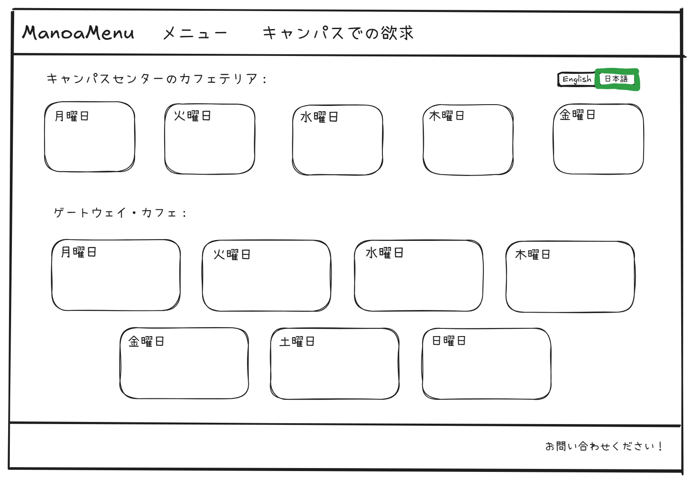

# Manoa Menu


## Table of contents

- [Manoa Menu](#manoa-menu)
  - [Table of contents](#table-of-contents)
  - [Overview](#overview)
  - [Approach](#approach)
  - [User Guide](#user-guide)
    - [Landing Page](#landing-page)
    - [Menu Page](#menu-page)
    - [Dashboard Page](#dashboard-page)
    - [Popular Items Page](#popular-items-page)
    - [Translation Page](#translation-page)
    - [Exchange Rate](#exchange-rate)
    - [Sign-in and Sign-up](#sign-in-and-sign-up)
  - [Community Feedback](#community-feedback)
  - [Developer Guide](#developer-guide)
    - [Installation](#installation)
    - [Application Design](#application-design)
  - [Continuous Integration](#continuous-integration)
  - [Development History](#development-history)
  - [Example Enhancements](#example-enhancements)
  - [Team](#team)
    - [Team Contract](#team-contract)

## Overview

**The problem:** International students at UHM, particularly those from Japan, may find it difficult to read the Campus Center cafeteria menu. With local and western dishes that aren’t self-explanatory, using translation tools like Google Translate on each week's menu is tedious and often inaccurate.

**The solution:** The Manoa Menu web application translates the cafeteria menu from English to Japanese, ensuring accurate and culturally aware descriptions. The app adds supplementary information for menu items that might be unfamiliar. Users can view the menu without needing to log in, while logged-in users can save their favorite items and check if these favorites appear on the current week's menu.

## Approach
* **Frontend (Next.js):**
  * Menu and dashboard with clear, user-friendly interface
  * Translated menu and cultural item descriptions
  * Menu scraping from PDFs using tools like [PDF-Parse](https://www.npmjs.com/package/pdf-parse) or [PDF2JSON](https://www.npmjs.com/package/pdf2json)
* **Backend (Prisma ORM & PostgreSQL):**
  * Database for user data and saved menu items
  * OpenAI API calls to generate descriptive details for unfamiliar menu items

## User Guide

This section provides an overview of Manoa Menu's user interface and functionalities.

### Landing Page

The landing page greets users and introduces Manoa Menu's purpose and features.


### Menu Page

This page shows the current cafeteria menu. By default, it displays in English, but users can select the Japanese translation if desired.

For Campus Center Menu scraping: [PDF-Parse NPM](https://www.npmjs.com/package/pdf-parse)

For Gateway Menu scraping: [Puppeteer NPM](https://www.npmjs.com/package/puppeteer)


### Dashboard Page

Accessible after logging in, this page displays:
  - Saved favorite items and an indicator if any of these items are on this week’s menu
  - Recommended menu items, based on previous favorites


### Popular Items Page

This page shows popular menu items among other students, with an option to add items to favorites.


### Translation Page

This page displays the website in the language chosen by the user.



### Exchange Rate

This feature allows a foreign currency to be displayed next to the dollar value of an item. The user may choose a currency from a dropdown menu.


### Sign-in and Sign-up

Click the "Login" button in the upper right corner to go to the sign-in page. Only registered users can sign in:


Alternatively, select "Sign up" to register as a new user:


## Community Feedback

We’d love to hear your thoughts on Manoa Menu! Feel free to take a few minutes to fill out the [Manoa Menu Feedback Form](https://forms.gle/fp6cH6FRNwqR3KMP6), which has just five questions to help us improve the system.

## Developer Guide

This section provides information for developers who want to contribute to or customize Manoa Menu.

### Installation

1. [Install Node.js](https://nodejs.org/) and [Next.js](https://nextjs.org/).
2. Clone the repository from the [Manoa Menu GitHub page](https://github.com/manoamenu/manoamenu).
3. Install dependencies with:

   ```bash
   npm install
   ```

4. Start the development server with:

   ```bash
   npm run dev
   ```

5. Access the app at [http://localhost:3000](http://localhost:3000).

### Application Design

Manoa Menu uses Next.js for its frontend, while the backend is structured with Prisma ORM and PostgreSQL. The data model includes tables for users, menu items, and saved favorites, supporting relational queries to efficiently manage user data and preferences.

## Continuous Integration

Manoa Menu uses GitHub Actions to automatically run linting and tests for each commit to the main branch. You can view recent workflow results at [https://github.com/manoamenu/manoamenu/actions](https://github.com/manoamenu/manoamenu/actions).

## Development History

The development of Manoa Menu follows Issue Driven Project Management practices. Each milestone is managed through GitHub Project Boards.

* [Milestone 1](https://github.com/orgs/manoa-menu/projects/2): Initial mockup and user flow.
* Milestone 2: Data model and basic CRUD functionality.
* Milestone 3: Translation feature integration and UI improvements.

## Example Enhancements

Here are some suggested enhancements:

* **Add icons for cultural descriptions:** Display an icon next to menu items to indicate culturally relevant notes.
* **Enable weekly email notifications:** Send users a summary of the week’s menu, highlighting their favorites.
* **Admin dashboard:** Allow admin users to add or edit menu descriptions and moderate user feedback.
* **Additional language support:** Extend support to other common languages among UHM international students.

## Team

ManoaMenu is designed, implemented, and maintained by [Brendan Kuwabara](https://github.com/BYKuwabara), [Adam Graham](https://github.com/usradam), [Eric Kim](https://github.com/erickimtypes), [Dat Truong](https://github.com/DatTruong606), and [Justin Sumiye](https://github.com/practical-software)

[Contact us](https://forms.gle/9PpZQAKeNpWkX4NNA) if you have any comments or questions.

### [Team Contract](https://docs.google.com/document/d/1WQ-8HhZOTxxuxRtMikDlzCzVJDAc71cl1xgYNTWC_qc/edit?tab=t.0)
